# Toa Mistake Tracker

Tracks mistakes made by players throughout the Tombs of Amascut.

---
This plugin will track mistakes for you and your teammates in the Tombs of Amascut.

By default, when detecting a mistake, all players with this plugin will receive a public message of the mistake, a chat
overhead above the player who made the mistake, and the mistake will be added to the Toa Mistake Tracker side-panel.

Current mistakes being tracked:

*  **Deaths** throughout the raid
    * 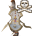 **Death in the Path of Het**
    * 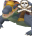 **Death in the Path of Crondis**
    * 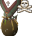 **Death in the Path of Scabaras**
    * 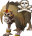 **Death in the Path of Apmeken**
    * 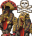 **Death in The Wardens**
*  **Het Puzzle energy beam** damage
*  **Het Puzzle dark orb** damage
* 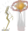 **Akkha quadrant special attacks**
  damage
*  **Akkha elemental special attacks**
  damage
*  **Akkha unstable orb** damage
* 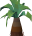 **Crondis Puzzle low watering**
* 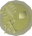 **Zebak Acid** damage
*  **Zebak blood cloud** damage
* 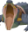 **Zebak scream** damage
* 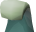 **Zebak wave** damage
*  **Kephri bomb** non-vengeance damage
*  **Apmeken Puzzle sight** team damage
*  **Apmeken Puzzle venom** damage
* 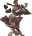 **Apmeken Puzzle volatile** damage
* 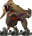 **Ba-Ba slam** damage
*  **Ba-Ba projectile
  boulder** damage
* 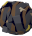 **Ba-Ba rolling boulder**
  damage
*  **Ba-Ba falling boulder**
  damage
* 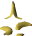 **Ba-Ba banana** damage
*  **Ba-Ba gap** falling
*  **Wardens P1 pyramids** damage
* 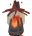 **Wardens P2 obelisk special
  attacks** damage
* 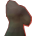 **Wardens P2 bind** hit
* 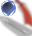 **Wardens P2 special
  prayer attack** prayer miss
* 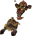 **Wardens P3 slam attack**
  damage
*  **Wardens P3 Akkha attack** prayer miss (
  no announcement)
*  **Wardens P3 Zebak attack** prayer miss (
  no announcement)
*  **Wardens P3 Kephri attack** damage
*  **Wardens P3 Ba-Ba attack** damage
*  **Wardens P3 lightning** damage (
  no announcement)

---

## Screenshots

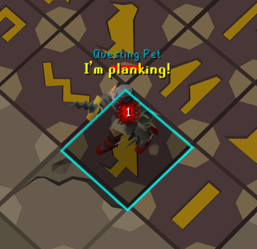

---

## Changes

#### 1.2

* Fixed Wardens P2 special prayer (divine projectile) attack counting as a mistake even if nulled from core being out

#### 1.1

* Fixed Akkha special attacks detecting a mistake when the player was not actually hit, due to a recent game change

#### 1.0

* Initial release